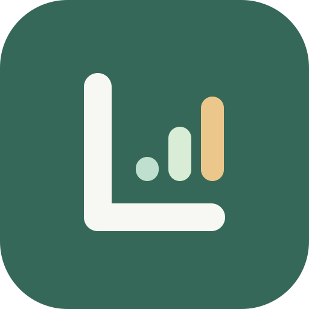

# Logria

三个板块，一份每日记录。完全离线的 Android 训练、饮食及身体测量日志，使用 Flutter 和 Dart 开发。
本项目独立于 Summa，不共享代码仓库、数据或服务。

[English](README.md) · [下载公开 APK](https://github.com/ManiaAmaeOvo/Logria/releases/latest) ·
[中文更新日志](CHANGELOG.zh-CN.md) · [中文使用说明](docs/USER_GUIDE.zh-CN.md) · [MIT 许可](LICENSE)

## 版本状态

最新 Release 是 1.3.0 build 10，新增历史训练补录／修改、未记录日默认休息及凌晨 04:00 分日，并合并此前本地版本的中文文档和内嵌更新日志。旧 1.2.0 Release、附件及标签不变。
Build 8／9 的本地改动已合并到本次发布。

## 已实现功能

- 今日：直接查看当天训练、饮食、营养和身体数据，保存复盘备注，整日或单板块复制。
- 训练：可编辑 PPL／PPL × 2／四分化计划，移动休息日，跳过、撤销与恢复，选择首日，重新开始中断的循环而保留历史。
- 训练记录：组数、次数、重量、RIR，自动保存草稿，保护手动修改组的首次同步，沿用上次记录作为模板。
- 动作：常见预设、单次动作和独立变式备注；重量支持数字或文本，文本明确映射为 0／null。
- PR 与有氧：自选动作每日最大重量曲线、手动 PR，独立有氧时长、可选距离及备注。
- 饮食：先记文本后补营养，逐餐汇总或每日手动覆盖，P/C/F/kcal 独立目标／上限。
- 食材：12 种离线参考预设和自建成品／整餐方案，按克、毫升、份、瓶、勺、袋缩放，在饮食记录中快捷添加。
- 营养：P/C/F 自动估算热量，kcal／kJ 联动并保留手动标签值；可选钠、钾、钙、铁、膳食纤维及目标／下限／上限。
- 身体：八种指标按日期部分更新，近 30／90 天或全部历史曲线。
- 日历：查看历史日期，定位训练轮次，复制所选日期日志。
- 设置：中英文或跟随系统，软件信息，离线双语使用说明及自动跟随应用语言的更新日志。

## 安装与数据安全

要求 Android 7.0／API 24 及以上。下载 APK 后根据系统提示允许对应来源安装。
从旧版升级请直接覆盖安装，不要先卸载或清除应用数据；相同应用 ID 和签名才能原位升级。
官方 APK 仍使用既有开发签名以保持兼容，不是 Google Play 生产签名。CI 的签名不同，不应当作官方更新包。

无账号、云同步、广告、分析追踪或内置 LLM 请求，Release 不申请联网权限。
记录保存在当前设备的 SQLite；食物参考离线内置，未知营养不当作零。
复制只写入系统剪贴板，是否发送给其他应用由你决定。GitHub 链接由外部浏览器打开。
目前没有可恢复的备份或 JSON 文件导入导出，剪贴板日志不能恢复数据库。

## 中文文档

- [完整使用说明](docs/USER_GUIDE.zh-CN.md)
- [更新日志](CHANGELOG.zh-CN.md)
- [隐私与本地数据](docs/PRIVACY.zh-CN.md)
- [食物数据与标签录入](docs/FOOD_DATA.zh-CN.md)
- [测试清单和问题反馈](docs/TESTING.zh-CN.md)
- [贡献指南](CONTRIBUTING.zh-CN.md)

开发细节仍可阅读英文 [架构](docs/ARCHITECTURE.md)、[发布流程](docs/RELEASE.md) 和 [UI 检查](docs/UI_REVIEW.md)。
JSON [schema](docs/export/logria-health-log.schema.json) 只是规划协议，不是已实现的导出器。

## 本地开发

使用 Flutter 3.47.2／Dart 3.13.2，以及既有 Android SDK 和模拟器。

```sh
flutter pub get
flutter gen-l10n
dart run build_runner build
dart format lib test
flutter analyze
flutter test
flutter run
flutter build apk --release
```

## 当前限制与参与

尚无可恢复备份／JSON 导入导出、估算 1RM／PR 通知、体重联动营养模板／碳循环、自定义身体指标和云集成。
整餐预设保存输入的合计营养，不是自动食材配方计算器。
可在 GitHub Issues 反馈版本、语言、系统和复现步骤，请隐藏私人健康数据。

开发人员：ManiaAmaeOvo · gpt6.1sol。代码使用 MIT 许可；营养参考不是医疗建议。
